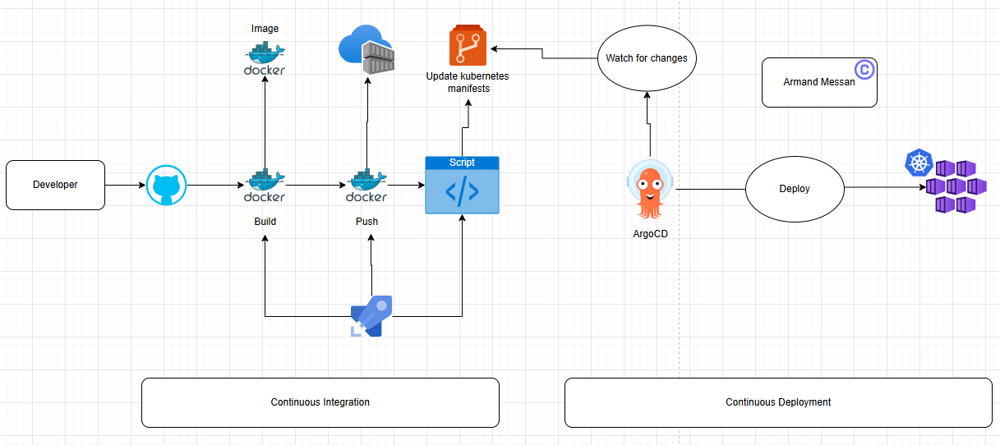

After completing the continuous integration [here](../az_devops_ci_pipelines_implementation_lab/readme.md),
For the continuous delivery we will use gitops approach.

In the previous continuous integration [part](../az_devops_ci_pipelines_implementation_lab/readme.md), once the docker image is created in the build stage, azure pipeline automatically triggers the push stage. Then the artefact is pushed into azure containers registries (ACR).

In this continuous delivery part we will use the gitops approach, and use a gitops tool called ArgoCD. With we will deploy the containers into our kubernetes cluster.



We will add a new stage to our current pipeline. This new stage will update the new created image version to the azure repository (specific yaml files or kubernetes manifests in k8s-specifications). In the azure repo, there is a script called `updateK8sManifests.sh`. Once an image is pushed to the ACR the shell script will go through this manifests and update the value of the key `image`.
For example: - image: user-azure-ci-cd/business-app:107
Gitops is always watching for a change in the git repository, as soon as an update is made to a manifest, gitops pulls the change and deploy it to the kubernetes cluster.

We will also write the creation of kubernetes cluster and configure argocd.

# Create kubernetes kluster on azure portal with Azure Kubernetes Service (AKS)
`az portal` > `Kubernetes services` > `Create` > `Kubernetes cluster`


Select agent pool


Update agent pool


`Review and create` > `Create` will create a kubernetes cluster.

## Login to the cluster
We suppose azure CLI is already installed and configured on your system. Enter following to login
```shell
az login
```
```shell
az aks get-credentials --name azuredevops --overwrite-existing --resource-group azurecicdt
```
You should then get the output ```Merged azuredevops as current context in <users>/.kube/config```

## Install ArgoCD to the cluster

## Configure ArgoCD with the kubernetes cluster

## Write the update shell script