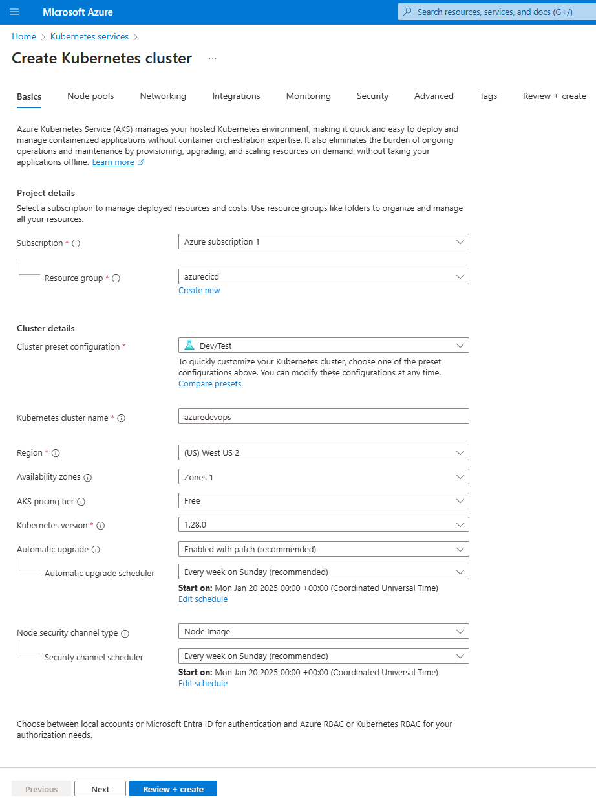
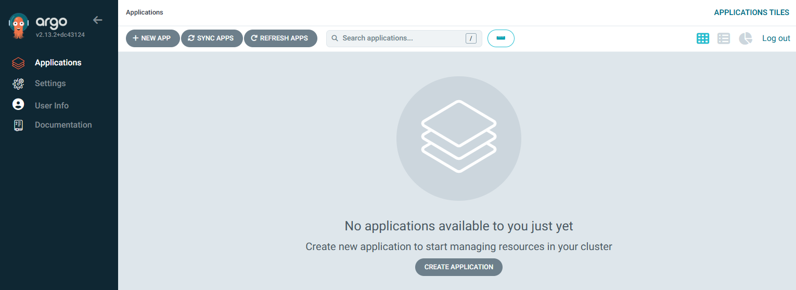

After completing the continuous integration [here](../az_devops_ci_pipelines_implementation_lab/readme.md),
For the continuous delivery we will use gitops approach.

In the previous continuous integration [part](../az_devops_ci_pipelines_implementation_lab/readme.md), once the docker image is created in the build stage, azure pipeline automatically triggers the push stage. Then the artefact is pushed into azure containers registries (ACR).

In this continuous delivery part we will use the gitops approach, and use a gitops tool called ArgoCD. With we will deploy the containers into our kubernetes cluster.


We will add a new stage to our current pipeline. This new stage will update the new created image version to the azure repository (specific yaml files or kubernetes manifests in k8s-specifications). In the azure repo, there is a script called `updateK8sManifests.sh`. Once an image is pushed to the ACR the shell script will go through this manifests and update the value of the key `image`.
For example: - image: user-azure-ci-cd/business-app:107
Gitops is always watching for a change in the git repository, as soon as an update is made to a manifest, gitops pulls the change and deploy it to the kubernetes cluster.

We will also write the creation of kubernetes cluster and configure argocd.

# Create kubernetes kluster on azure portal with Azure Kubernetes Service (AKS)
`az portal` > `Kubernetes services` > `Create` > `Kubernetes cluster`



Select agent pool


Update agent pool


`Review and create` > `Create` will create a kubernetes cluster.

## Login to the cluster
We suppose azure CLI is already installed and configured on your system. Enter following to login
```shell
az login
```
```shell
az aks get-credentials --name azuredevops --overwrite-existing --resource-group azurecicd
```
You should then get the output ```Merged azuredevops as current context in <users>/.kube/config```

## Install ArgoCD to the cluster
On your local system Windows/WSL/MacOS/Linux follow the step 1 from this page
https://argo-cd.readthedocs.io/en/stable/getting_started/
These instructions will create a namespace `argocd`, and deploy all the manifest resources such as redis, the argo workloads, services, repo servers, etc... 
When the deployment is done, run following to check if all pods are up and running:
```shell
kubectl get pods -n argocd
```
Expected output:
```shell
NAME                                                READY   STATUS    RESTARTS   AGE
argocd-application-controller-0                     1/1     Running   0          5m35s
argocd-applicationset-controller-64f6bd6456-vvbdp   1/1     Running   0          5m36s
argocd-dex-server-5fdcd9df8b-v8p5p                  1/1     Running   0          5m36s
argocd-notifications-controller-778495d96f-hbkmz    1/1     Running   0          5m36s
argocd-redis-69fd8bd669-r4bv9                       1/1     Running   0          5m36s
argocd-repo-server-75567c944-grxbx                  1/1     Running   0          5m36s
argocd-server-5c768cdd96-stfbg                      1/1     Running   0          5m36s
```
All pods should be running.

## Configure ArgoCD with the kubernetes cluster
### Login to argocd
Run:
```shell
kubectl get secrets -n argocd
```
Output:
```shell
NAME                          TYPE     DATA   AGE
argocd-initial-admin-secret   Opaque   1      12m
argocd-notifications-secret   Opaque   0      13m
argocd-redis                  Opaque   1      12m
argocd-secret                 Opaque   5      13m
```
Let's copy and edit the secret `argocd-initial-admin-secret`:
```shell
kubectl edit secrets argocd-initial-admin-secret -n argocd
```
Output:
```shell
apiVersion: v1
data:
  password: <PASSWORD>
kind: Secret
metadata:
  creationTimestamp: "2025-01-20T19:27:05Z"
  name: argocd-initial-admin-secret
  namespace: argocd
  resourceVersion: "17460"
  uid: 046cb23d-ecba-4d46-a7b0-fa7f18e73c68
type: Opaque
```
Secrets are base64 encoded, so we need to decode it.
We copy the password from the previous output and decode as follow:
- on linux
```shell
echo <PASSWORD> | base64 --decode
```
- on windows 
```shell
echo TlNYZlVKdFpvbU5xM3dIRw== | base64 --decode
```

The output is the decoded password. If the output contains a percentile at the end, just ignore it.
Now we have the admin password, and the argocd admin username is `admin`.
### Access argocd 
Let's run this command to check the type of the argocd-server:
```shell
kubectl get svc -n argocd
```
Output:
```shell
NAME                                      TYPE        CLUSTER-IP       EXTERNAL-IP   PORT(S)                      AGE
argocd-applicationset-controller          ClusterIP   10.105.178.144   <none>        7000/TCP,8080/TCP            35m
argocd-dex-server                         ClusterIP   10.104.85.223    <none>        5556/TCP,5557/TCP,5558/TCP   35m
argocd-metrics                            ClusterIP   10.105.70.139    <none>        8082/TCP                     35m
argocd-notifications-controller-metrics   ClusterIP   10.101.90.254    <none>        9001/TCP                     35m
argocd-redis                              ClusterIP   10.98.6.26       <none>        6379/TCP                     35m
argocd-repo-server                        ClusterIP   10.97.91.196     <none>        8081/TCP,8084/TCP
35m
argocd-server                             ClusterIP   10.111.248.83    <none>        80/TCP,443/TCP
```
It's running in `ClusterIP` node.
Now let's access the argocd UI, for that we need to expose argocd in the nodeport mode.
```shell
kubectl edit svc argocd-server -n argocd
```
Change `type: ClusterIP` to `type: NopePort` and save the file.
If we run again `kubectl get svc -n argocd`, `argocd-server` should now have the type `NodePort`
```shell
argocd-server                             NodePort    10.111.248.83    <none>        80:32238/TCP,443:31796/TCP   39m
```
Whereas the (http) node port is `31796`. 
Now let's get the node external IP:
```shell
kubectl get nodes -o wide
```
Output:
```shell
NAME                                STATUS   ROLES   AGE   VERSION   INTERNAL-IP   EXTERNAL-IP      OS-IMAGE             KERNEL-VERSION      CONTAINER-RUNTIME
aks-agentpool-18580224-vmss000002   Ready    agent   68m   v1.28.0   10.224.0.4    52.247.235.249   Ubuntu 22.04.5 LTS   5.15.0-1075-azure   containerd://1.7.23-1
```
Whereas the `external ip address` is `52.247.235.249`.
Now let's try to access the argocd UI on a webbrowser as follow `<ip address>:<http node port>`, `52.247.235.249:31796`.
We won't be able to access to page, because we didn't opened the port in the network security group.
Let's open the port. On the azure portal search for `Virtual machine scale sets`, click on the node pool `aks-agentpool-<ID>-vmss` > `Instances` > `aks-agentpool-<ID>-vmss_<NUMBER>`


Go to `Networking` > `Network settings` > `Create port rule` > `inbound port rule`


Under `Destination port ranges` replace the default port by the one of the `argocd-server`.


Go back to the webbrowser, and refresh the page, now argocd should be accessible


Enter the user `admin` and the base64 decoded password to sign in



Now let's connect argocd which is on our kubernetes cluster with the business app on azure repository.
We need either credentials or PAT to connect both of them. [Here](../az_devops_ci_pipelines_implementation_lab/readme.md#create-a-personal-access-toke-pat) we already learn how to create a PAT.
Let's go back to the argocd page > `Settings` > `Repositories` > `Connect repo` > 
- Under `repository url`, copy paste the repository url. To find the url, head to `azure devops` > `Repos` > `Clone` > copy the `https` url.
Now replace your username before `@` with your PAT. When you're done click on `Connect`.


Now the `connection status` should be `Successful`.
We are now done with connecting argocd to the repo.

Now let's connect argocd and deploy to the kubernetes cluster.
`argocd page` > `Applications` > `New app` 


Finish with `Create`.


Now argocd is configured. It is picking up all the manifests from the ``k8s-specifications`` folder and deploying it to the kubernetes kluster.
Now if there is any change to any of the manifests argocd will deploy it to the cluster.


## Write the update shell script
Let's add a new stage (update stage) for example to the vote-service pipeline. This update should pick up new images from the ACR and update it to the repository.

In `azure portal` > `Containers registries` > `labazurecicd` > `Repositories`, we have our microservices, that we wrote the pipelines for.
And they all have an tag number. And if you click for example on the `resultapp` tag, under `Manifest` you will be presented with 
a docker pull command `docker pull <azure-devops-domain-name>.azurecr.io/<repo-name>:<build-numider>`.
The format of that docker command should exactly be used by `updateK8sManifests.sh` when modifying the .yaml manifests under the `k8s-specifications` folder.

### Notice: Keep the agent pool `azureagent` running we will be running the pipelines

Go back to the azure repo, create a new folder `scripts`, and a new file [updateK8sManifests.sh](scripts/updateK8sManifests.sh) > `Commit`.

Let's add the update stage for instance to the vote pipeline yaml. Add this stage:
`azure-pipelines-vote.yml`
```yaml
- stage: Update
  displayName: Update
  jobs:
  - job: Update
    displayName: Update
    steps:
    - task: ShellScript@2
      inputs:
        scriptPath: 'scripts/updateK8sManifests.sh'
        args: 'vote $(imageRepository) $(tag)'
```

Then `settings` > in `Script Path` add the path to where we added `updateK8sManifests.sh` (`scripts/updateK8sManifests.sh`). Under `Arguments`, add `vote $(imageRepository) $(tag)`. 
Arguments used:
- `$1`: microservice name (vote|result|worker|db|redis)
- `$2`: repository name in ACR (resultapp|voteapp|workerapp)
- `$3`: tag id
Save and run the vote pipeline. All jobs should run and complete with the result succeeded in the agent pool console. When you check the `vote-deployment.yaml` under `k8s-specifications` you'll notice the value of the key `image`  has changed. And now you see something like this `- image: labazurecicd/voteapp:44`.

Let's not forget argocd is constantly also watching for the changes in the repo. Now it'll try to redeploy the manifests in our cluster. Let's change the argocd sync time from the default 3 minutes to 10 seconds, so that we don't have to wait that long. On your system console run:
```shell
kubectl edit cm argocd-cm -n argocd
```
Then edit in adding following at the end of the file and save:
```shell
data:
  timeout.reconciliation: 10s
```

## ImagePullSecrets - Correctly pull from a private repository
If you run `kubectl get pods` you witness some pods are labelled with hte status `ImagePullBackOff` or `ErrImagePull`, because we are pulling images from a private registry. Using the concept of `ImagePullSecrets` we can pull images from private repositories.
`Containers Registries` > `Container Registrie` > `labazurecicd` > `Settings` > `Access keys` > enable `Admin user`. We will be needing the username and password this page. Go back to the console and run:
```shell
data:
kubectl create secret docker-registry <secret-name> \
    --docker-server=<container-registry-name>.azurecr.io \
    --docker-username=<service-principal-ID> \
    --docker-password=<service-principal-password>
```
- `<secret-name>`: put anything. We use `acr-secret`
- ``<container-registry-name>``: in our case `labazurecicd`
- `<service-principal-ID>`: previous username
- `<service-principal-password>`: previous password

Let's go back to the `vote-deployment.yaml` and add following at the end of the file, then commit the change:
```shell
ImagePullSecrets:
      - name: acr-secret
```
`acr-secret` is the secret name we choose to use earlier. The file should now look like this:
`vote-deployment.yaml`:
```shell
apiVersion: apps/v1
kind: Deployment
metadata:
  labels:
    app: vote
  name: vote
spec:
  replicas: 1
  selector:
    matchLabels:
      app: vote
  template:
    metadata:
      labels:
        app: vote
    spec:
      containers:
      - image: labazurecicd/voteapp:44
        name: vote
        ports:
        - containerPort: 80
          name: vote
      ImagePullSecrets:
      - name: acr-secret
```

To verify the ci/cd just make a minor change to a file in the `vote` folder.
Our ci/cd pipeline will trigger automatically, after the `build` and `push` pipelines jobs are done, 
the `votingapp` will also be updated in the ACR with the new build id. 
The next job to run is the `update` one, after it's done, argocd will pick up the new change 
and deploy to our kubernetes cluster.
You can also run the following to see exactly what image ig is being deployed:
```shell
kubectl get deploy vote -o yaml
```
In the yaml output you should see:
```shell
...
spec:
  containers:
  - image: <ACR-name>.azurecr.io/votingapp:<build-id>
...
```

The UI of the deployed business app can be accessed with the external IP adress `52.247.235.249` followed
with the port of the `vote` service. To get the port of the `vote` service run:
```shell
kubectl get svc
```
Before pasting in a webbrowser `ip-address:port`, in your `vmss` add your port to the `inbound port` as before.
You should then land on the UI.