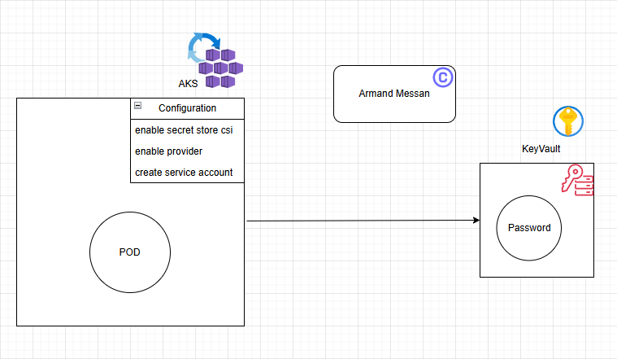
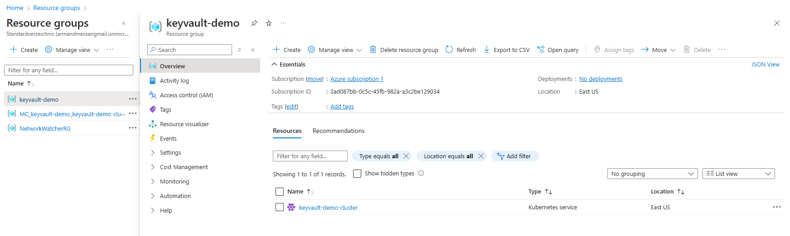
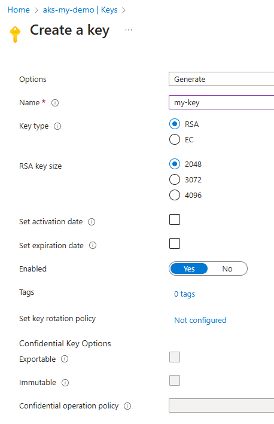
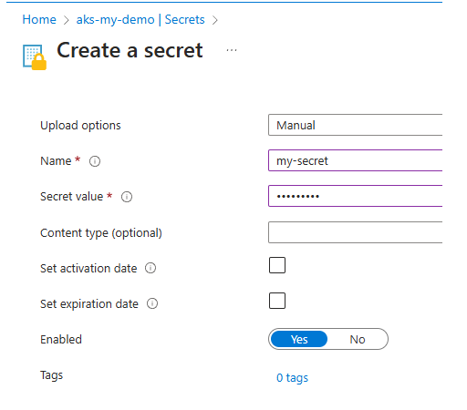
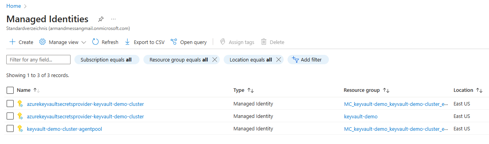

In this project we explore azure key vault. This practical hands-on will also explain how to integrate 
azure key vault with aks cluster using `Secrets Store CSI Driver`. We'll learn how a pod within a AKS cluster 
can reference a secret from azure key vault.

Key vault is a secret management service that is used to store sensitive information.
Kubernetes itself has out of the box a secret management that is using ``kubernetes secrets``.
But the advantage of going with azure key vault is `centralized` service, where you can store passwords, certificates, PAI token, etc...
in a centralized location. 
For example if a company has compliance or security best practices, the password (ci/cd related password or kubernetes connection string) 
should fro instance be changed every 90 days. All these sensitive information are spread across various tools, so `centralized` service
to ensure these sensitive information are located at one place and timely rotated.
Azure key vault also come with a Role-based Access Control (RBAC), where we can define a very strong RBAC with managed identities.
For instance there is a VM using a particular managed identities, and using it, we can view/write/read the secrets.
Another advantage, let's say we have a database with a password. And this DB is accessed by various resources from the azue platform.
When the time comes to update the password, we can just make the resources reference the new password in the key vault through
a managed identities.

# Devops usecase
In a key vault we store a password. We create a pod within an AKS cluster. We can ask the pod to access the sensitive information
from the key vault using the secret store driver. We'll also install all the configurations such as the key vault provider,
and learn how to connect the pod with the key vault.



We also need to create a managed identity. And using the managed identity we allow a pod to talk to a specific instance of the key vault we created. We then integrate the `service account` of the pod with the managed identity. And using the managed identity the pod will access the secrets in the key vault.

## AKS setup using CLI
Make Azure CLI is installed on your system.
### Create Azure Resource Group
```shell
az group create --name keyvault-demo --location eastus
```
```shell
Output:
{
  "id": "/subscriptions/<subscription-id>/resourceGroups/keyvault-demo",
  "location": "eastus",
  "managedBy": null,
  "name": "keyvault-demo",
  "properties": {
    "provisioningState": "Succeeded"
  },
  "tags": null,
  "type": "Microsoft.Resources/resourceGroups"
}
```
### AKS Creation and Configuration
Create an AKS cluster with Azure Key Vault provider for Secrets Store CSI Driver support
```shell
az aks create --name keyvault-demo-cluster -g keyvault-demo --node-count 1 --enable-addons azure-keyvault-secrets-provider --enable-oidc-issuer --enable-workload-identity
```
It takes a while to run and complete.
- `secrets-store-csi-driver` is a special kind of csi driver related to sensitive information. If you want to mount a sensitive information as part of a volume, you can mount a secret/password as a file onto your kubernetes pod. For that kubernetes has implemented a special kind of csi driver called as `secrets-store-csi-driver`.
- `azure-keyvault-secrets-provider`; we also have the possibility, after installing a kubernetes cluster, we can also install the `secrets-store-csi-driver` and along with ``azure key vault provider`` as an addon. With that the pod will be able to talk to the azure secret management solution.

Now we can verify if the resource group and cluster are created.
`Azure portal` > `Resource Groups` we see the name of our resource group ``keyvault-demo``, and under `Overview` we also can see the cluster `keyvault-demo-cluster`.



### Get the Kubernetes cluster credentials (Update kubeconfig)
Let's fetch the kubeconfig and update it with the kubernetes cluster we juste created
```shell
az aks get-credentials --resource-group keyvault-demo --name keyvault-demo-cluster
```
Output (windows):
```shell
Merged "keyvault-demo-cluster" as current context in C:<user>\.kube\config
```
With following command we can verify if we are pointing to the correct cluster:
```shell
kubectl config current-context
```
Output:
```shell
keyvault-demo-cluster
```
### Verify that each node in your cluster's node pool has a Secrets Store CSI Driver pod and a Secrets Store Provider Azure pod running
Let's check if our secret store csi driver pods are running
```shell
kubectl get pods -n kube-system -l 'app in (secrets-store-csi-driver,secrets-store-provider-azure)' -o wide
```
We can see the sci driver and provider are running on the same cluser. Output:
```shell
NAME                                     READY   STATUS    RESTARTS   AGE   IP            NODE                                NOMINATED NODE   READINESS GATES
aks-secrets-store-csi-driver-pvqdf       3/3     Running   0          58m   10.244.0.64   aks-nodepool1-10670825-vmss000000   <none>           <none>
aks-secrets-store-provider-azure-4wb2s   1/1     Running   0          58m   10.224.0.4    aks-nodepool1-10670825-vmss000000   <none>           <none>
```

### Keyvault creation and configuration
Create a key vault with Azure role-based access control (Azure RBAC).
```shell
az keyvault create -n aks-my-demo -g keyvault-demo -l eastus --enable-rbac-authorization
```
Output:
```shell
{
  "id": "/subscriptions/<subscription-id>/resourceGroups/keyvault-demo/providers/Microsoft.KeyVault/vaults/aks-my-demo",
  "location": "eastus",
  "name": "aks-my-demo",
  "properties": {
    "accessPolicies": [],
    "createMode": null,
    "enablePurgeProtection": null,
    "enableRbacAuthorization": true,
    "enableSoftDelete": true,
    "enabledForDeployment": false,
    "enabledForDiskEncryption": null,
    "enabledForTemplateDeployment": null,
    "hsmPoolResourceId": null,
    "networkAcls": null,
    "privateEndpointConnections": null,
    "provisioningState": "Succeeded",
    "publicNetworkAccess": "Enabled",
    "sku": {
      "family": "A",
      "name": "standard"
    },
    "softDeleteRetentionInDays": 90,
    "tenantId": "<id>",
    "vaultUri": "https://aks-my-demo.vault.azure.net/"
  },
  "resourceGroup": "keyvault-demo",
  "systemData": {
    "createdAt": "2025-01-25T13:26:07.102000+00:00",
    "createdBy": "<email-address>",
    "createdByType": "User",
    "lastModifiedAt": "2025-01-25T13:26:07.102000+00:00",
    "lastModifiedBy": "email-address",
    "lastModifiedByType": "User"
  },
  "tags": {},
  "type": "Microsoft.KeyVault/vaults"
}
```
Save the `subscription id` from the first line of the output, we'll be needing it.
Now let's head to `azure portal` > `Key Vaults`, and we should see our resource `aks-my-demo`.
Under `Objects` > `Keys`, we can see ``you are unauthorized to view these contents.``. Under `Access control (IAM)` > `Grant access to this resource` > `Add role assignment`, under `Role` select `Key Vault Administrator.` Under `Members` > `Members` > `Select members`, select the user of your choice > `select` > `Review + assign`.
After a couple of minutes, we should no more see ``you are unauthorized to view these contents.``. Now let's generate a key and secret:





## Connect your Azure ID to the Azure Key Vault Secrets Store CSI Driver
Let's create a managed identity in order to connect the csi driver to it.
### Configure workload identity
```shell
export SUBSCRIPTION_ID=<subscription-id>
export RESOURCE_GROUP=keyvault-demo
export UAMI=azurekeyvaultsecretsprovider-keyvault-demo-cluster
export KEYVAULT_NAME=aks-my-demo
export CLUSTER_NAME=keyvault-demo-cluster

az account set --subscription $SUBSCRIPTION_ID
```

### Create a managed identity
```shell
az identity create --name $UAMI --resource-group $RESOURCE_GROUP

export USER_ASSIGNED_CLIENT_ID="$(az identity show -g $RESOURCE_GROUP --name $UAMI --query 'clientId' -o tsv)"
export IDENTITY_TENANT=$(az aks show --name $CLUSTER_NAME --resource-group $RESOURCE_GROUP --query identity.tenantId -o tsv)
```
Let's head to `azure portal` > `Managed identities`, and see our managed identities.



### Create a role assignment that grants the workload ID access the key vault
The next step is to grant to the managed identity access to the key vault.
```shell
export KEYVAULT_SCOPE=$(az keyvault show --name $KEYVAULT_NAME --query id -o tsv)

az role assignment create --role "Key Vault Administrator" --assignee $USER_ASSIGNED_CLIENT_ID --scope $KEYVAULT_SCOPE
```

If some reason you are getting following error
```shell
$ az role assignment create --role "Key Vault Administrator" --assignee $USER_ASSIGNED_CLIENT_ID --scope $KEYVAULT_SCOPE
ERROR: (MissingSubscription) The request did not have a subscription or a valid tenant level resource provider.
Code: MissingSubscription
Message: The request did not have a subscription or a valid tenant level resource provider.
```

### Get the AKS cluster OIDC Issuer URL
We need the OIDC in order to connect the service account of the kubernetes pod with the managed identity.
```shell
export AKS_OIDC_ISSUER="$(az aks show --resource-group $RESOURCE_GROUP --name $CLUSTER_NAME --query "oidcIssuerProfile.issuerUrl" -o tsv)"
echo $AKS_OIDC_ISSUER
```
Output:
```shell
https://eastus.oic.prod-aks.azure.com/c01703d3-a558-4c73-8722-bbddffa34b34/42665e67-4a30-4fab-80fe-0660e8c10bb3/
```

### Create the service account for the pod
```shell
export SERVICE_ACCOUNT_NAME="workload-identity-sa"
export SERVICE_ACCOUNT_NAMESPACE="default" 
```
```shell
cat <<EOF | kubectl apply -f -
apiVersion: v1
kind: ServiceAccount
metadata:
  annotations:
    azure.workload.identity/client-id: ${USER_ASSIGNED_CLIENT_ID}
  name: ${SERVICE_ACCOUNT_NAME}
  namespace: ${SERVICE_ACCOUNT_NAMESPACE}
EOF
```
Output:
```shell
serviceaccount/workload-identity-sa created
```

### Setup Federation
Here we are connecting the service account with the managed identity, thus we are using the concept of OIDC and federation.
```shell
export FEDERATED_IDENTITY_NAME="aksfederatedidentity" 

az identity federated-credential create --name $FEDERATED_IDENTITY_NAME --identity-name $UAMI --resource-group $RESOURCE_GROUP --issuer ${AKS_OIDC_ISSUER} --subject system:serviceaccount:${SERVICE_ACCOUNT_NAMESPACE}:${SERVICE_ACCOUNT_NAME}
```
Output:
```shell
{
  "audiences": [
    "api://AzureADTokenExchange"
  ],
  "id": "/subscriptions/<subscription-id>/resourcegroups/keyvault-demo/providers/Microsoft.ManagedIdentity/userAssignedIdentities/azurekeyvaultsecretsprovider-keyvault-demo-cluster/federatedIdentityCredentials/aksfederatedidentity",
  "issuer": "https://eastus.oic.prod-aks.azure.com/c01703d3-a558-4c73-8722-bbddffa34b34/42665e67-4a30-4fab-80fe-0660e8c10bb3/",
  "name": "aksfederatedidentity",
  "resourceGroup": "keyvault-demo",
  "subject": "system:serviceaccount:default:workload-identity-sa",
  "systemData": null,
  "type": "Microsoft.ManagedIdentity/userAssignedIdentities/federatedIdentityCredentials"
}
```
Now the kubernetes pod is connected to the managed identity, and the managed identity has access to the key vault provider.
We will assign the secret provider class to the pod we are going to create, and within the pod it should access

### Create the Secret Provider Class
In this secret provider class we will mention what object(s) we want to access `my-key` and `my-secret` from the key vault `aks-my-demo`
```shell
cat <<EOF | kubectl apply -f -
# This is a SecretProviderClass example using workload identity to access your key vault
apiVersion: secrets-store.csi.x-k8s.io/v1
kind: SecretProviderClass
metadata:
  name: azure-kvname-wi # needs to be unique per namespace
spec:
  provider: azure
  parameters:
    usePodIdentity: "false"
    clientID: "${USER_ASSIGNED_CLIENT_ID}" # Setting this to use workload identity
    keyvaultName: ${KEYVAULT_NAME}       # Set to the name of your key vault
    cloudName: ""                         # [OPTIONAL for Azure] if not provided, the Azure environment defaults to AzurePublicCloud
    objects:  |
      array:
        - |
          objectName: my-secret             # Set to the name of your secret
          objectType: secret              # object types: secret, key, or cert
          objectVersion: ""               # [OPTIONAL] object versions, default to latest if empty
        - |
          objectName: my-key                # Set to the name of your key
          objectType: key
          objectVersion: ""
    tenantId: "${IDENTITY_TENANT}"        # The tenant ID of the key vault
EOF
```
Output:
```shell
secretproviderclass.secrets-store.csi.x-k8s.io/azure-kvname-wi created
```

## Verify Keyvault AKS Integration
### Create a sample pod to mount the secrets
Let's use a simple busy-box pod. The busy-box container is not doing anything specific, but we just use it to verify if it will be able to mount the volumes. It should be able to fetch the secrets and mount the volumes. It should also be able to mount the secrets in its `mountPath`
```shell
cat <<EOF | kubectl apply -f -
# This is a sample pod definition for using SecretProviderClass and workload identity to access your key vault
kind: Pod
apiVersion: v1
metadata:
  name: busybox-secrets-store-inline-wi
  labels:
    azure.workload.identity/use: "true"
spec:
  serviceAccountName: "workload-identity-sa"
  containers:
    - name: busybox
      image: registry.k8s.io/e2e-test-images/busybox:1.29-4
      command:
        - "/bin/sleep"
        - "10000"
      volumeMounts:
      - name: secrets-store01-inline
        mountPath: "/mnt/secrets-store"
        readOnly: true
  volumes:
    - name: secrets-store01-inline
      csi:
        driver: secrets-store.csi.k8s.io
        readOnly: true
        volumeAttributes:
          secretProviderClass: "azure-kvname-wi"
EOF
```
Output:
```shell
pod/busybox-secrets-store-inline-wi created
```
If we run `kubectl get pods`, it should be runnig:
```shell
NAME                              READY   STATUS    RESTARTS   AGE
busybox-secrets-store-inline-wi   1/1     Running   0          65s
```


### List the contents of the volume
Let's verify if the volume is mounted and if we can access the secrets. We are actually listing the files in this location `/mnt/secrets-store/`, this is where we mounted the volume in the pod.
```shell
kubectl exec busybox-secrets-store-inline-wi -- ls /mnt/secrets-store/
```
Outout:
```shell
my-key
my-secret
```

### Verify the contents in the file
Let's try to fetch the content of one of the secrets `my-key`
```shell
kubectl exec busybox-secrets-store-inline-wi -- cat /mnt/secrets-store/my-key
```
Output:
```shell
-----BEGIN PUBLIC KEY-----
<CONTENT>
-----END PUBLIC KEY-----
```
That is it.

